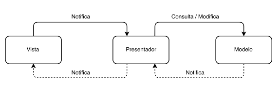

# MVP

## Introducción
MVP (Modelo Vista Presentador) es un patrón arquitectónico utilizado en el desarrollo de software moderno que surge como una alternativa al patrón MVC (Modelo Vista Controlador) y que favorece el desacoplamiento entre la lógica de negocio de una aplicación y su presentación.

## Índice

* [¿Qué está mal con MVC?](#Problemas)
* [Componentes de MVP](#Componentes)
* [Comunicación entre las partes](#Comunicacion)
* [Navegación](#Navegacion)
* [Functional reactive programming](#FRP)
* [FAQ](#FAQ)

## ¿Qué está mal con MVC?

El patrón [Modelo Vista Controlador](https://developer.apple.com/library/content/documentation/General/Conceptual/DevPedia-CocoaCore/MVC.html) es la solución de arquitectura por defecto en el ecosistema Apple. Según la documentación oficial de Apple, La utilización de MVC lleva a la construcción de software mantenible y a partes reutilizables.
Se basa en los siguientes principios: 

* La vista recibe el input del usuario y notifica de ello al Controlador.
* El Controlador recibe el evento de la vista y modifica al modelo.
* El Modelo es modificado y notifica al Controlador de ello.
* El Controlador entonces modifica la vista.

Esta arquitectura en la práctica, sin embargo, no brinda los resultados esperados, sobre todo porque la mayor parte de las responsabilidades recaen en el controlador, que es responsable, en los peores casos de:

* Escuchar todos los eventos de la vista y modificarla oportunamente
* Realizar llamadas a las APIs
* Realizar queries de bases de datos
* Modificar el modelo
* Realizar la navegación entre las diferentes pantallas de la aplicación.
* etc, etc, etc.

En estos casos se suele recurrir a patrones de diseño, y otras formas de desacoplar los componentes para reducir el tamaño del controlador, pero estas no son más que parches sobre una arquitectura deficiente. Es por eso que si la aplicación va a tomar un tamaño considerable, es necesario optar por una arquitectura más desacoplada.

##  Componentes de MVP

MVP contempla tres capas en su arquitectura.

1. **[Modelo:](#Model)** El modelo es la lógica de negocio, la capa de acceso a datos y las entidades del negocio. Las llamadas a la API, queries de bases de datos y otros accesos a datos se encuentran en objetos contenidos en esta capa.

2. **[Vista:](#View)** Una de las diferencias más importantes entre el patrón MVC y MVP es que en el patrón MVC, la vista y el controlador pertenecen a capas diferentes. En MVP, en cambio, ambos objetos pertenecen a la capa de Vista. **La Vista es la única capa en MVP que importa UIKit**. Además, es importante considerar que La vista no conoce directamente a las entidades del modelo, sino a representaciones simplificadas de las mismas que se adecúan a lo que la vista requiere para configurarse a sí misma.

3. **[Presentador:](#Presenter)** El presentador contiene la lógica de negocio para cada una de las pantallas de la aplicación. Por cada pantalla en una aplicación existe un presentador único. **Un presentador no se puede compartir entre varias pantallas**. Además, el presentador es el encargado de convertir las entidades del modelo en entidades específicos para las vistas.

## Modelo

El modelo en MVP es muy similar a la capa de modelo en MVC salvo porque en nuestra implementación, la capa de modelo incluye clases especializadas en el acceso a datos.

> Who supposed to own networking request: a Model or a Controller?
> [iOS Architecture Patterns](https://medium.com/ios-os-x-development/ios-architecture-patterns-ecba4c38de52#.ges7g22ro)

Consideramos que el View Controller no debe estar encargado de hacer llamadas a la API, ni buscar datos en la base de datos local del dispositivo, ni comunicarse por medio de WebSockets, etc. De hecho, planteamos la división de responsabilidades un poco más allá y planteamos las dos siguientes restricciones.

* El View Controller pertenece a la capa de vista, de modo que no debe conocer el modelo.
* El Presenter debe saber que tiene que obtener los datos, pero no debe saber de qué modo se obtienen esos datos.

Por lo tanto la arquitectura define una clase llamada **DataManager** que se encarga de obtener los datos y devolverlos, sin especificar de donde provienen.

## Vista

La vista en MVP es un conjunto de clases de importan UIKit, especialmente View Controller y View. 

## Presentador

## Comunicación entre las partes

## Navegación

Para propósitos de navegación, se utiliza una clase **Router** que está asociado al View Controller y dirige el flujo de navegación actual de la aplicación.

Las responsabilidades del Router son las siguientes:

1. Recibir una petición de navegación de parte del Controller.
2. Instanciar el View Controller de destino.
3. Instanciar el Presenter de destino.
4. Instanciar el Router de destino.
5. Asociar el View Controller de destino con el Presenter de destino.
6. Asociar el View Controller de destino con el Router de destino.
7. Efectuar la navegación.

## Functional reactive programming

## FAQ

